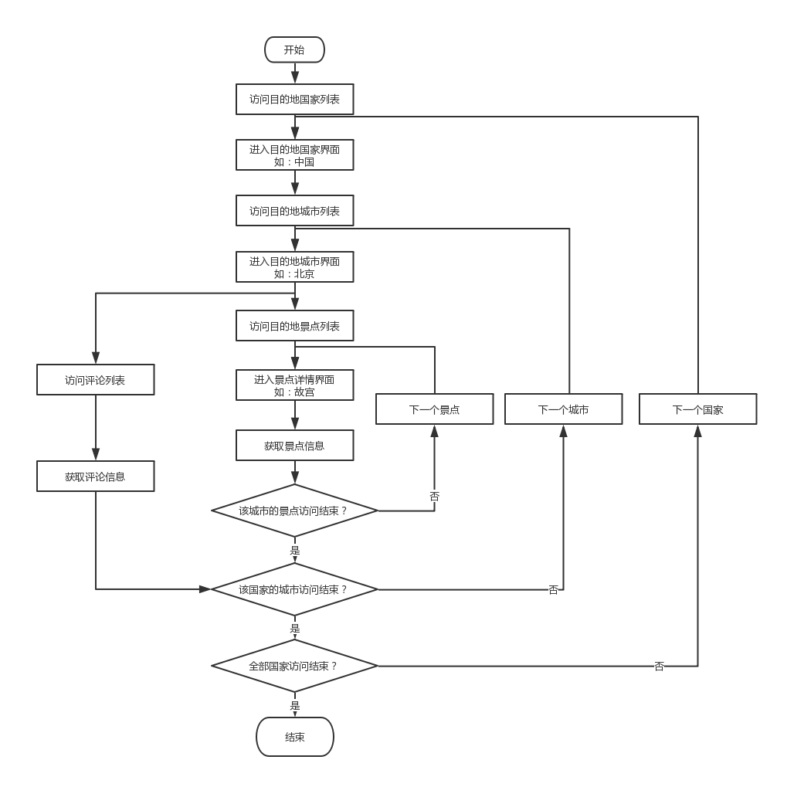

### 一、流程简介

#### 1. 网页访问流程

景点信息按照国家-城市-景点的层次依次遍历获取。评论信息按照国家-城市-评论的层次依次遍历获取，期间需要筛选出针对景点的评论。



#### 2. 需要爬取的信息

- 景点：名称、ID、简介、地址开放时间、交通信息、参考游玩时间、与其他景点距离
- 评论：用户昵称、评价景点的ID、评分、评价时间、评价内容、点赞数、回复数

### 二、实现

#### 1. 爬虫

首先根据实验要求和网页访问流程编写了**景点信息爬虫**（spot）和**评论信息爬虫**（review）。

后在实验中发现：爬取景点信息时，由于代理或是网络原因，有少部分数据只保存了景点的ID，而没有保存其他信息。故又添加了**针对遗漏景点的爬虫**（recap），直接根据景点的ID构造景点链接，并爬取数据。

```json
{
  "id": "g24217",
  "name": null,
  "nation": "约旦",
  "city": "杰拉什",
  "desc": null,
  "addr": null,
  "open_time": null,
  "traffic": {},
  "rec_play_time": null,
  "site_dist": {
    "must": {},
    "near": {}
  }
}
```

#### 2. IP池

使用由[jhao104](https://github.com/jhao104)在Github开源的[proxy_pool](https://github.com/jhao104/proxy_pool)抓取各大免费代理网站公开的代理IP搭建IP池。它将免费网络代理IP存储在redis数据库中，每间隔一段时间抓取代理写入数据库并删除不可用的代理。后在网上购买代理，并将其添加至proxy_pool项目中（API已失效）。

#### 3. 工具

- getnull

查找已爬取数据中信息不全的景点并汇总，方便爬虫继续爬数据

- combine

将重新爬取数据的文件和含有遗漏数据的文件汇总

- statistics

统计已爬数据字符串属性的长度，节省数据库空间开销

- insert

将爬取的所有数据写入数据库中

### 三、遇到的问题及解决办法

#### 1. IP被封

使用Github开源的[proxy_pool](https://github.com/jhao104/proxy_pool)抓取各大免费代理网站公开的IP搭建IP池。它将免费网络代理存储在redis数据库中，每间隔一段时间抓取代理写入数据库并删除不可用的代理。后又在网上购买代理，并将API添加至proxy_pool中自用。

#### 2. 伪造UA

使用[fake-useragent](https://pypi.python.org/pypi/fake-useragent)库随机生成UA，让爬虫更难被针对。

#### 3. 默认爬虫速度慢

- 查看文档后发现，默认下载超时为180秒。将下载超时时间改成30秒。
- 去除[proxy_pool](https://github.com/jhao104/proxy_pool)项目中内对国外代理的抓取。
- 设定较大的`CONCURRENT_REQUESTS`，并发更多请求。
- 本来为了保险起见设定了`DOWNLOAD_DELAY`，实际中发现即使不设置也不会被很快封IP，特别是有IP池之后，所以就没有设置下载延迟。

#### 4. 由于网络原因或网络代理不可用出现的错误

在SETTING中允许重试、设定重试次数并设定需要重试的响应代码。

#### 5. 由于下载器问题导致的错误

该问题是在下载阶段代理不可用导致。需要从IP池中获取新的代理，重新发送请求。

#### 6. 爬虫运行时间长

- 本地爬取数据时使用`scrapy craw xxx -s JOBDIR=your/path/to/job`命令保存爬虫进度，中断后再次执行会按照之前的进度继续。
- 将爬虫和IP池部署到服务器上后台执行。

#### 7. 景点数据不完整

提取不完整数据的id，针对遗漏信息的景点重新爬取。

#### 8. 按单条数据写入数据库慢

将1000条数据合并到一条sql语句中，每1000条数据执行一次插入操作。

